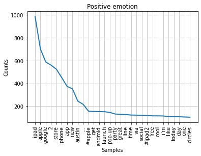
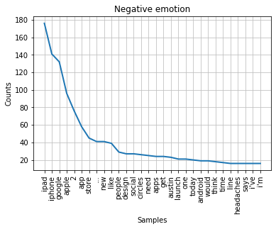
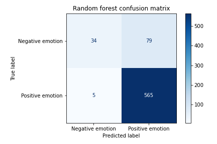
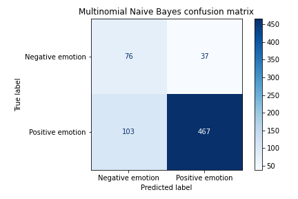

# Twitter Sentiment Analysis on Tech Brands

## Introduction
Sentiment analysis is a type of analysis derived from natural language processing that is beneficial to adapt for any company providing products and services for consumers. Using the [scikit-learn](https://scikit-learn.org/stable/index.html) and [NLTK library](http://www.nltk.org/index.html), we create a model that can predict the sentiment of a Twitter tweet based on its content. This model serves as a proof of concept that such predictions can be made based on the content of our data.

## Business Problem
Customer feedback is a crucial part of the business of providing consumer products and services, as without feedback, we would be left not knowing how best to improve our products to appeal to our existing consumer base and reach out further to more people. One way we could go about reviewing customer feedback data to further improve as a business is by using a sentiment analysis model. According to [MonkeyLearn](https://monkeylearn.com/), a company with a machine learning platform for text analysis, [sentiment analysis](https://monkeylearn.com/sentiment-analysis/) can benefit us as a company in a few ways: 

- We are able to **sort data at scale** -- instead of individually reviewing and sorting through thousands of social media posts and customer surveys, sentiment analysis models can help process huge amounts of data in an efficient and cost-effective way.
- With sentiment analysis models, we can perform **real-time analysis** during support conversations with customers over support channels or social media to  identify potential issues and address them as quickly as possible.
- A centralized sentiment analysis model would ensure that we can process our feedback data with **consistent criteria** so we can obtain more accurate, optimal insights.

By using sentiment analysis models that can sort through customer feedback and predict their sentiments, we can make decisions to maximize sales and customer satisfaction when launching new products and services, as well as track their feelings over time. That way, we can analyze feelings of our target audience towards our brand and make informed decisions to retain and possibly expand our consumer base as well.

## Data
The data we will be using comes from [data.world](https://data.world/crowdflower/brands-and-product-emotions) and contains a sample of tweets from Twitter about multiple brands and products, primarily Apple and Google. A crowd of human raters were asked to rate each tweet based on the perceived emotion of the tweet, rating them as showing positive, negative, or no emotion. This data can be found in the repository's `data` folder.

## Methods
With our sentiment analysis model, since we are primarily aiming to create a model that can discern between positive and negative sentiment, after importing the data I created a new dataframe that only contained tweets distinctly labeled with "Positive emotion" or "Negative emotion". Using the NLTK library, we can examine the types of words that are the most common among positive and negative tweets. First, we use the `TweetTokenizer` function to tokenize our tweets so that each tweet is split into an array of individual words. We then lowercase all the words in each tweet to avoid duplicate overlap of the same words in different cases and remove stopwords in each tweet. We decide which "stopwords" to remove based on commonly used words ("the", "and", etc.), punctuation symbols, and other words that are irrelevant to the topic of our analysis. Using the `FreqDist` function, we see that overall, people had more feelings to share both ways for Apple products than Google products. However, just looking at the top 30 words of each emotion, the positive tweets tend to share more common words with positive connotations (e.g. "great" and "cool") where with the negative tweets, it's possible that each tweet was unique to specific complaints that users had (in the top 30 words the only common negative word is "headaches").





Some more preprocessing steps that were taken before fitting the models include lemmatization and oversampling. Lemmatization changes variants of words down to a root word through linguistic mappings within the function (i.e. "running" and "ran" would become "run"); this way, we can try to reduce the amount of the same words but with different suffixes that our model takes in. After lemmatizing the data, I then used `train_test_split` from scikit-learn to split the data into training and holdout sets for fitting our models. 

When observing the data, I noticed that there was a significant class imbalance between positive and negative tweets; to remedy this imbalance, I used the [SMOTE](https://imbalanced-learn.org/stable/references/generated/imblearn.over_sampling.SMOTE.html) function from the [imblearn](https://imbalanced-learn.org/stable/index.html) library. This oversamples the minority class (in this case the negative tweets) by creating synthetic entries based on examples of our existing data and adds them to the training dataset. Note that we only perform this on the training data, as performing it on our test data would affect the integrity of our holdout data and the validity of our model, as desertnaut on [Stack Overflow](https://stackoverflow.com/questions/48805063/balance-classes-in-cross-validation/48810493#48810493) notes.


## Results
The first model I ran was a [Random Forest](https://scikit-learn.org/stable/modules/generated/sklearn.ensemble.RandomForestClassifier.html) model. Before fitting our data on this model, I also initialize the [TF-IDF vectorizer](https://scikit-learn.org/stable/modules/generated/sklearn.feature_extraction.text.TfidfVectorizer.html) to convert our text data into vectors that the scikit-learn algorithm can process when running this model. We then use cross-validation using `cross_val_score` to evaluate the model and use the average of the cross-validated scores to gain an understanding of the accuracy of the model. This model performed very well to start off, with an average accuracy of 0.88. We can also visualize the performance of this model against our holdout data using a confusion matrix.



Next, I ran a [Multinomial Naive Bayes](https://scikit-learn.org/stable/modules/generated/sklearn.naive_bayes.MultinomialNB.html) model, which is suited for classification problems such as this one involving text classification. Although this model didn't perform as well as our previous model, it still performed fairly well with an average accuracy of 0.80.



Lastly, I ran an [XGBoost](https://xgboost.readthedocs.io/en/latest/python/python_api.html#module-xgboost.sklearn) model from the XGBoost library, which creates machine learning models using optimized gradient boosting algorithms. This model performed almost as well as our random forest model, but falls slightly short with an average accuracy score of 0.87. 


## Conclusion
Our random forest model ended up performing the best out of all our models, scoring with an accuracy of 0.87. However, all our models performed fairly well -- even our weakest model, the multinomial Naive Bayes model, didn't score much lower than our best model. As this baseline model serves as a proof of concept, we can further expand on this model using more tweet data -- and possibly other forms of customer feedback such as surveys and comments -- to come up with more ideas to improve our services and maintain and expand our consumer base.

### Next Steps
- In our raw dataset, more than half of our dataset had null values in the `emotion_in_tweet_is_directed_at` column that tells us what product the tweet was directed at, so it would not have been a good idea to look at sentiment for Apple vs Google products. In the future, I would like to perform a more detailed comparison between positive and negative tweets about products from both companies and see how they contrast.
- There were also a fair amount of tweets that were labeled as "I can't tell"; I would like to investigate those entries, figure out why they were labeled as such, and possibly integrate them into our dataset.
- Instead of oversampling our training data to compensate for the lack of negative tweets, we can integrate other datasets containing more negative tweets and incorporate that data into our pre-existing analysis.
- I would like to incorporate a deep learning model to evaluate our data. Not only would it serve as yet another model we can test to predict the sentiment of a tweet with based on our data we used here, but we can possibly create a sentiment analysis model that can take in Twitter data and label tweets for us to expand on our data.

## For More Information
You can review the full analysis in the [Jupyter Notebook](./Twitter_Sentiment_Analysis.ipynb) or the [presentation](./Twitter_Sentiment_Analysis_Presentation.pdf)

For any additional questions, please contact **Nancy Ho** at [nancyho83@yahoo.com].


## Sources


## Repository Structure
```
├── README.md                                            <- Top-level README for reviewers of this project
├── Twitter_Sentiment_Analysis.ipynb                     <- Narrative documentation of analysis in Jupyter notebook
├── Twitter_Sentiment_Analysis_Presentation.pdf          <- PDF version of project presentation
├── data                                                 <- Both sourced externally and generated from code
└── images                                               <- Both sourced externally and generated from code
```